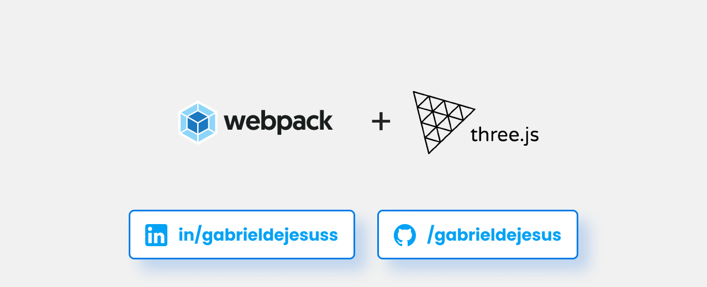

# Webpack + Three.js

🛴 A simple starter with webpack and Three.js

<p align="center">

</p>

<p align="left">
   

   

   

   

  <a href="https://github.com/gabrieldejesus">
    
  </a>
</p>

## 🚀 Getting started

Windows:

You can clone the repository through CMD (Command Prompt) just by typing:

```sh
git clone https://github.com/gabrieldejesus/webpack-threejs-starter
```

or download the zip from the green button at the beginning of the repository


## 💻 Configuration for development

- Open project folder

- Execute command: `yarn` or `npm run`

- Run the command to enter developer mode `yarn dev` or `npm run dev`
- Project running at:
  - http://192.168.138.51:8080
  - http://localhost:8080

## 🗃 Release history

- 0.0.2
    - Finish project and studying the possibility of adding `new resources`
- 0.0.1
  - Work in progress

## 📝 Meta

Gabriel de Jesus – [My Portfólio](https://gabrieldejesus.dev) – hi@gabrieldejesus.dev

Distributed under the MIT License. See [LICENSE](LICENSE) for more information.

[https://github.com/gabrieldejesus/webpack-threejs-starter](https://github.com/gabrieldejesus/)

## 🚀 Contribution

1. Make the _fork_ of the project (<https://github.com/gabrieldejesus/webpack-threejs-starter/fork>)
2. Create a _branch_ for your modification (`git checkout -b my-new-resource`)
3. Do _commit_ (`git commit -am 'Adding a new resource ...'`)
4. _Push_ (`git push origin my-new-feature`)
5. Create a new _Pull Request_

**After your pull request is merged**, you can safely delete your branch.

---

Made with 💙 by [Gabriel de Jesus](https://gabrieldejesus.dev)
